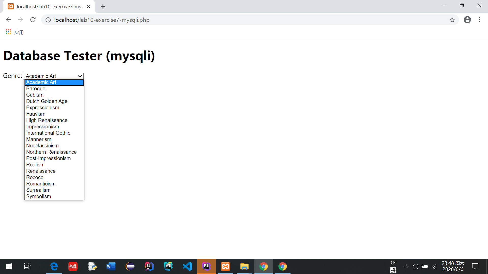

# Lab10 文档

 
## Exercise7: MYSQL THROUGH PHP

**一、 PDO**
代码：
```
try {
    $pdo = new PDO(DBCONNSTRING,DBUSER,DBPASS);
    //初始化一个PDO对象
    $pdo->setAttribute(PDO::ATTR_ERRMODE, PDO::ERRMODE_EXCEPTION);
    // setAttribute()设置“数据库连接对象”属性;设置ATTR_ERRODE属性来控制sql执行出错时的行为表现;PDO::ERRMODE_EXCEPTION：抛出异常
    $sql = "select * from Artists order by LastName";
    //将Artists表按LastName从小到大排序
    $result = $pdo->query($sql);
    //用于执行查询sql语句，返回PDOStatement对象
    while ($row = $result->fetch()) {  //每次获取一行记录
        echo $row['ArtistID'] . " - " . $row['LastName'] . "<br/>";
        //打印
    }
    $pdo = null;
    //通过赋null值来释放
}catch (PDOException $e) {
    die( $e->getMessage() );
}
?>
```

  


**二 、 MYSQL**
代码：
```
  <?php
    $connection = mysqli_connect(DBHOST, DBUSER, DBPASS, DBNAME);
    //生成一个到MySQL服务器的新连接，获得数据库资源
    if ( mysqli_connect_errno() ) { //返回连接错误代码值，如果没有错误发生则返回0，用来检查确认连接的结果
        die( mysqli_connect_error() );
    }
    $sql = "select * from Genres order by GenreName";
    //将Genres表按GenreName从小到大排序
    if ($result = mysqli_query($connection, $sql)) {
        // loop through the data
        while($row = mysqli_fetch_assoc($result)) {
            //mysqli_fetch_assoc() 函数从结果集中取得一行作为关联数组，如果结果集中没有更多的行则返回 null
            echo '<option value="' . $row['GenreID'] . '">';
            echo $row['GenreName'];
            echo "</option>";
            //用循环依次生成一段的<option>的html标签并打印
        }
        mysqli_free_result($result);
        //释放结果集内存
    }
    mysqli_close($connection);
    //断开数据库链接
    ?>
```

  


## Exercise8: INTEGRATING USER INPUTS (PDO)  


1. `outputArtists()`
代码：
```
   function outputArtists() {
   try {
         $pdo = new PDO(DBCONNSTRING,DBUSER,DBPASS);
       //初始化一个PDO对象
         $pdo->setAttribute(PDO::ATTR_ERRMODE, PDO::ERRMODE_EXCEPTION);
       // setAttribute()设置“数据库连接对象”属性;设置ATTR_ERRODE属性来控制sql执行出错时的行为表现;PDO::ERRMODE_EXCEPTION：抛出异常
         $sql = "select * from Artists order by LastName limit 0,30";
       //将Artists表按LastName从小到大排序并从0开始读取30个
         $result = $pdo->query($sql);
       //用于执行查询sql语句，返回PDOStatement对象
         while ($row = $result->fetch()) {
            echo '<a href="' . $_SERVER["SCRIPT_NAME"] . '?id=' . $row['ArtistID'] . '" class="';
            if (isset($_GET['id']) && $_GET['id'] == $row['ArtistID']) echo 'active ';
             //isset()用来检测变量是否已声明；预定义的 $_GET 变量用于收集来自 method="get" 的表单中的值
            echo 'item">';
            echo $row['LastName'] . '</a>';
            //在循环中输出每一行的LastName，并设置a标签的各项属性
         }
         $pdo = null;
       //通过赋null值来释放
   }
   catch (PDOException $e) {
      die( $e->getMessage() );
   }
}
```
   
2. `outputPaintings()`
代码：
```
 function outputPaintings() {
    try {
        if (isset($_GET['id']) && $_GET['id'] > 0) {
            //isset()用来检测变量是否已声明;预定义的 $_GET 变量用于收集来自 method="get" 的表单中的值(接受的参数，就是前台通过get方法传到后端的id值)
            $pdo = new PDO(DBCONNSTRING,DBUSER,DBPASS);
            //初始化一个PDO对象
            $pdo->setAttribute(PDO::ATTR_ERRMODE, PDO::ERRMODE_EXCEPTION);
            // setAttribute()设置“数据库连接对象”属性;设置ATTR_ERRODE属性来控制sql执行出错时的行为表现;PDO::ERRMODE_EXCEPTION：抛出异常
            $sql = 'select * from Paintings where ArtistId=' . $_GET['id'];
            //从Paintings找出ArtistId和接受的参数id值相同的记录
            $result = $pdo->query($sql);
            //用于执行查询sql语句，返回PDOStatement对象
            while ($row = $result->fetch()) {
                outputSinglePainting($row);
                //执行outputSinglePainting方法
            }
            $pdo = null;
            //通过赋null值来释放
        }
    }catch (PDOException $e) {
        die( $e->getMessage() );
    }
}
 ```  
3. `outputSinglePainting($row)`
代码：
```
function outputSinglePainting($row) {
    //获得$row传输的参数
    echo '<div class="item">';
    echo '<div class="image">';
    echo '';
    echo '</div>';
    //打印照片
    echo '<div class="content">';
    echo '<h4 class="header">';
    echo $row['Title'];
    echo '</h4>';
    //打印标题
    echo '<p class="description">';
    echo $row['Excerpt'];
    echo '</p>';
    //打印描述性语句
    echo '</div>'; // end class=content
    echo '</div>'; // end class=item
}
```
   
   
  


## Exercise9: PREPARED STATEMENTS  

** The way to execute sql code**

① executeQuery方法

用于产生单个结果集（ResultSet）的语句，例如 SELECT 语句。 被使用最多的执行 SQL 语句的方法。
这个方法被用来执行 SELECT 语句，它几乎是使用最多的 SQL 语句。
但也只能执行查询语句，执行后返回代表查询结果的ResultSet对象。

② executeUpdate方法

用于执行 INSERT、UPDATE 或 DELETE 语句以及 SQL DDL（数据定义语言）语句，例如 CREATE TABLE 和 DROP TABLE。
INSERT、UPDATE 或 DELETE 语句的效果是修改表中零行或多行中的一列或多列。
executeUpdate 的返回值是一个整数（int），指示受影响的行数（即更新计数）。
对于 CREATE TABLE 或 DROP TABLE 等不操作行的语句，executeUpdate 的返回值总为零。


③ execute方法

 可用于执行任何SQL语句，返回一个boolean值，表明执行该SQL语句是否返回了ResultSet。
如果执行后第一个结果是ResultSet，则返回true，否则返回false。但它执行SQL语句时比较麻烦，
通常我们没有必要使用execute方法来执行SQL语句，而是使用executeQuery或executeUpdate更适合，
但如果在不清楚SQL语句的类型时则只能使用execute方法来执行该SQL语句了。


** The advantage of using PreparedStatement **

①性能：PreparedStatement预编译SQL语句，网络传输量比Statement更小，数据库不需要再进行编译，响应更快，性能更好
②可读性和可维护性：PreparedStatement无须“拼接”SQL语句，编程更简单
③安全性：PreparedStatement可以防止SQL注入，安全性更好。 


   


   


