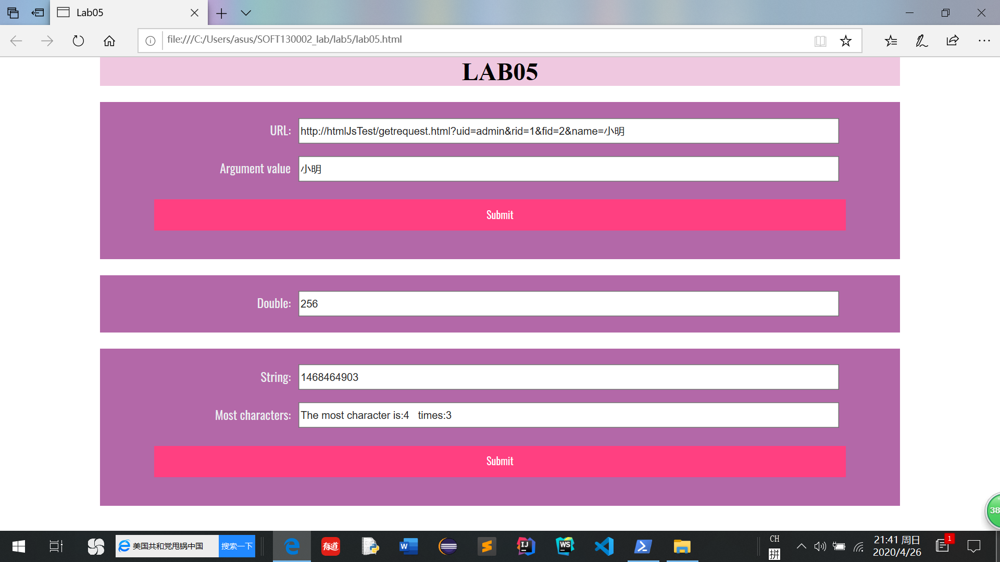

##LAB5设计文档
**一、showWindowHref**
①用RegExp来支持正则表达式，判断字符串中是否有name属性
②用if语句来区分是否有name的两种情况和是否有&以及name前后有无&的情况
③用substring来提取name=后&前的字符串，用indexOf来确定name=和&的下标
**二、timeTest**
①用setInterval函数来进行隔段时间执行函数
②用clearInterval来停止setInterval函数
③用new Date().getMinutes()函数来判断是否到了下个整分
**三、arrSameStr**
①创建一个空对象
②用for循环遍历字符串，循环过程中如果定义的对象里有这个字符的话,那么这个字符的值加1
③求最大值时，遍历对象，求出对象里出现最多字符的次数并且赋值给maxNum
④定义一个空数组，再次遍历这个对象，如果当前的对象里的字符出现次数等于maxNum的话,就在空数组里添加这个字符
**四、网页截图**
